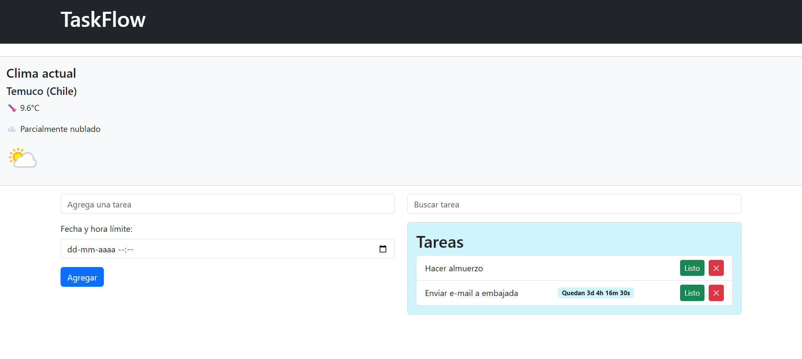

# TaskFlow: Gestor de Tareas en JavaScript

## 📝 Informe

La aplicación permite gestionar tareas de forma simple, aplicando los conceptos vistos en las cinco lecciones: **POO, ES6+, eventos, asincronía y consumo de APIs**.

---

## 🚀 Funcionalidades principales

- **POO**: Clase `Tarea` y clase `GestorTareas` para administrar la lista.
- **ES6+**: Uso de `const/let`, template literals y arrow functions.
- **Eventos y DOM**: Formulario para agregar tareas, botones para cambiar estado/eliminar, buscador con `keyup`.
- **Asincronía**: `setTimeout` y `setInterval` para simular retardo y contador.
- **Consumo de APIs**:
  - **WeatherAPI** para mostrar clima.
  - **JSONPlaceholder** como API de prueba.
  - Persistencia con `localStorage`.
  - Manejo de errores con `try/catch`.

---

## 📌 Entregables

- Código fuente documentado con comentarios.
- Aplicación funcional que gestiona tareas y consulta clima.
- Este informe breve como explicación de cumplimiento.

---

## 📸 Captura de pantalla (ejemplo)

